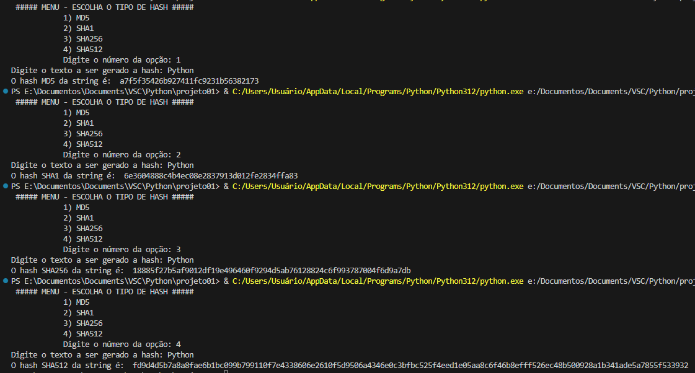

# Gerador de hashes
Script que gera um tipo de hash de acordo com um texto.

- O menu oferece opções de tipos de hashes para o usuário escolher;
- Logo depois é solicitado o texto que deseja ser convertido;
- De acordo com sua escolha a hash é gerada :

